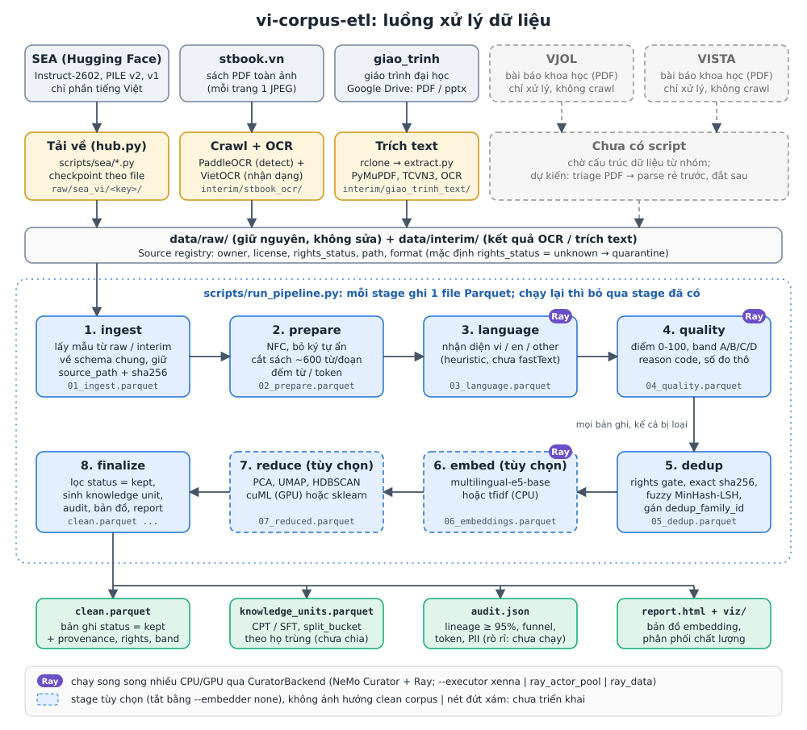
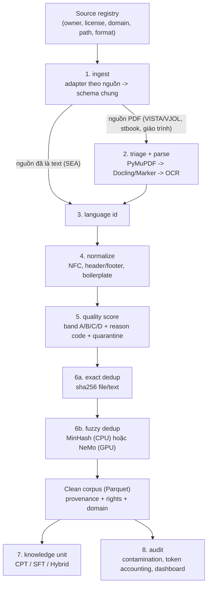

# Chiến lược xử lý dữ liệu (vi-corpus-etl)

> Trạng thái: **đã có code bản đầu** ở `vi_corpus/pipeline/` (ingest, normalize, chunk, language, quality, dedup, knowledge unit, audit, report) chạy bằng `scripts/run_pipeline.py`; ngưỡng chất lượng và language id (heuristic) là điểm khởi đầu, cần chỉnh sau khi xem `report.html` trên dữ liệu thật. Đã có adapter NeMo Curator + Ray (`vi_corpus/pipeline/curator.py`) chạy song song language/quality/embed/OCR trên nhiều CPU/GPU, và bản đồ embedding plotly (stage embed/reduce, `viz.py`); hướng dẫn chạy ở README Phần D. Chưa có: VISTA/VJOL, quét rò rỉ benchmark, adapter Curator cho fuzzy dedup. Tham khảo `paper-data-etl` và `ViLA`,
> đã rà soát và điều chỉnh (xem mục 5). Lộ trình theo tuần xem `docs/ROADMAP.md`.

## 1. Nguyên tắc
- **Disk-chained**: mỗi stage đọc Parquet của stage trước, ghi Parquet + manifest mới; chạy lại từng stage độc lập, có checkpoint theo file (dùng lại cơ chế `vi_corpus/sea/checkpoint.py` và `vi_corpus/common/state.py`).
- **Raw-first**: dữ liệu gốc giữ nguyên, mọi bước xử lý ghi ra thư mục riêng (`data/raw/` không bị sửa).
- **Kiến trúc lai**: stage tự viết (Python + Parquet/DuckDB, chạy được trên Jupyter). Stage nặng (fuzzy dedup, quality filter) có adapter NeMo Curator, chỉ bật khi có Ray/GPU.
- **Không sửa nội dung**: chỉ chuẩn hóa Unicode/định dạng; không paraphrase, dịch, hay sửa số liệu/tên/DOI.
- **Mọi lần loại bỏ đều có reason code**; chất lượng kỹ thuật và quyền sử dụng là hai trục tách biệt.
- **Không chia train/val/test ở tầng corpus**; việc chia (CPT/SFT/Hybrid) làm ở tầng knowledge unit, luôn chia theo `dedup_family_id`.

## 2. Luồng xử lý
Sơ đồ theo code hiện tại (nguồn SVG: [diagrams/00_pipeline.svg](diagrams/00_pipeline.svg), bản PNG: [diagrams/00_pipeline.png](diagrams/00_pipeline.png)):



Luồng con của từng module (cùng thư mục `docs/diagrams/`, vẽ theo code ở commit `0db0fc9`; khung nét đứt là phần đã chốt trong `DECISION_LOG.md` nhưng chưa code). **Lưu ý 2026-10-08**: đợt code các quyết định G-01…G-06 (mục 6 bên dưới) đã đổi 01, 03, 04, 06, 08; các sơ đồ đó chưa vẽ lại (chỉ 07 đã sửa dòng HDBSCAN), đọc mục 6 khi thấy lệch.

| Sơ đồ | Module | Nội dung |
|---|---|---|
| [01_runner](diagrams/01_runner.svg) | `pipeline/runner.py` | checkpoint theo stage, `--force-from`, `--until`, manifest |
| [02_ingest](diagrams/02_ingest.svg) | `pipeline/ingest.py` | lấy mẫu parquet / jsonl.gz, nguồn sách nguyên cuốn |
| [03_prepare](diagrams/03_prepare.svg) | `pipeline/normalize.py`, `lines.py`, `chunk.py`, `tokens.py` | chuẩn hoá Unicode, xoá dòng lặp, cắt đoạn theo token, lấy mẫu đoạn, đếm token |
| [04_language](diagrams/04_language.svg) | `pipeline/language.py` | fastText `lid.176` theo đoạn văn, `lang_mix` (heuristic cũ vẫn chọn được) |
| [05_quality](diagrams/05_quality.svg) | `pipeline/quality.py` | số đo, lỗi cứng / mềm, band |
| [06_dedup](diagrams/06_dedup.svg) | `pipeline/dedup.py`, `dedup_global.py` | cổng quyền, exact / MinHash-LSH theo văn bản, L1 bao hàm, exact theo đoạn, họ trùng, kho dấu vân tay + vòng 2 |
| [07_embed_reduce](diagrams/07_embed_reduce.svg) | `pipeline/embed.py`, `reduce.py`, `viz.py` | embedding, PCA / UMAP / HDBSCAN, bản đồ |
| [08_finalize](diagrams/08_finalize.svg) | `pipeline/knowledge.py`, `contamination.py`, `audit.py`, `report.py` | verdict vòng 2, clean, knowledge unit, khối CPT, quét nhiễm benchmark, audit, report |
| [09_curator](diagrams/09_curator.svg) | `pipeline/curator.py` | chạy song song NeMo Curator + Ray |
| [10_sea_download](diagrams/10_sea_download.svg) | `vi_corpus/sea/` | tải SEA có khoá, checkpoint từng file |
| [11_stbook_ocr](diagrams/11_stbook_ocr.svg) | `vi_corpus/stbook/`, `common/ocr.py` | OCR sách, `clean_pages` |
| [12_giao_trinh](diagrams/12_giao_trinh.svg) | `vi_corpus/giao_trinh/`, `common/batch_extract.py`, `pdf_text.py` | kiểm kê, trích text theo trang |

Thiết kế đầy đủ, gồm cả phần chưa code (triage + parse PDF cho VISTA/VJOL, exact và fuzzy dedup tách bước):


## 3. Schema chung của clean corpus
`doc_id, source_key, source_path, source_sha256, text, language, domain, license, owner, rights_status, quality_band, reason_codes[], token_count, dedup_family_id, parser, normalizer_version, created_at`

KPI "≥95% truy vết nguồn" = tỷ lệ bản ghi có đủ `source_key`, `source_path`, `source_sha256`.

## 4. Quy tắc theo nguồn
| Nguồn | Điểm cần nhớ |
|---|---|
| SEA | Đã là text nên bỏ bước parse. `conversations` của SEA-Instruct-2602 là chuỗi Python-repr → `ast.literal_eval`, không dùng `json.loads`. |
| stbook | PDF toàn ảnh (mỗi trang 1 JPEG) nên bỏ triage, OCR thẳng: PaddleOCR detect + VietOCR nhận dạng (`vi_corpus/common/ocr.py`), kết quả ở `interim/stbook_ocr/`. Mỗi cuốn một bản ghi; text là OCR thô (còn số trang, chú thích) → normalize xử lý. |
| Giáo trình (Drive) | PDF/pptx, phần lớn có lớp chữ; trích bằng `vi_corpus/common/pdf_text.py`, làm sạch theo trang (header/footer, ghép dòng) trước khi ghép văn bản. Giữ sách tiếng Anh. Chi tiết: `docs/GIAO_TRINH.md`. |
| VISTA / VJOL | Chỉ **xử lý**, không crawl. PDF đã đặt tên theo sha256 (dùng làm khóa exact dedup). Cần triage (`text_native`, `mixed`, `image_only`, `corrupt`, `protected`, `non_article`) rồi parse "rẻ trước, đắt sau". Bài ở VJOL/VISTA chưa rõ quyền → `rights_quarantine`. |

## 5. Điểm đã điều chỉnh so với repo tham khảo
1. Split train/val/test chuyển xuống tầng knowledge unit (ảnh yêu cầu ma trận CPT/SFT/Hybrid).
2. Reducer/visualize: một `cluster_id` chung, HDBSCAN chạy một lần **trên ma trận embedding gốc** như ViLA (`--cluster-space raw`, mặc định; `pca50` / `umap10` là bước trung gian khi vector nhiều chiều quá nặng), không chạy trên toạ độ 2D (R-28). PCA 2D và UMAP 2D chỉ để vẽ, cùng tô theo nhãn đó. `min_cluster_size` mặc định theo ViLA `max(2, min(20, n // 10))`, `min_samples` chỉ truyền khi đặt rõ; tham số, số chiều, số cụm, tỉ lệ nhiễu ghi vào `manifest["reduce"]["cluster"]` và nhãn bản đồ (R-29, R-30). **Chưa làm**: fit trên mẫu phân tầng và dùng Datashader khi trên 100k điểm (`reduce.py` đang fit toàn bộ, `viz.py` vẽ plotly WebGL).
3. Dedup viết mới (ViLA chưa có): theo văn bản (R-19), exact + fuzzy MinHash cấu hình A (R-34) + L1 bao hàm + exact theo đoạn, nhóm `cpt` / `sft` (Q4), ưu tiên nguồn VJOL → SEA → stbook → khác (R-15), 2 vòng (D-09), gán `dedup_family_id`.
4. Không dùng normalizer/NER pháp lý của ViLA cho văn bản khoa học hoặc SEA.
5. Rights gate cấu hình trong source registry, mặc định `unknown -> quarantine`, **hiện chỉ gắn nhãn** (R-01): không loại, không ảnh hưởng dedup / knowledge unit.
6. Chỉ dùng uv + `pyproject.toml` (không còn `requirements.txt`).

## 6. Đợt code 2026-10-08 (các quyết định không cần chạy server)
Theo `docs/DECISION_LOG.md` (mục "Phiên 2026-10-08 (code)"). Mọi số ngưỡng dưới đây là giá trị khởi điểm đã chốt, **chưa hiệu chỉnh** trên dữ liệu thật.

| Stage | Thay đổi | Quyết định |
|---|---|---|
| mọi stage | **Vân tay stage**: băm(tham số stage + phiên bản code + vân tay stage trước; ingest dùng danh sách file đầu vào + kích thước). Mỗi stage chỉ băm các trường hồ sơ nguồn nó đọc (`runner.PROFILE_FIELDS`): chỉnh ngưỡng chất lượng chỉ chạy lại từ quality. Lệch thì xoá stage đó và các stage sau rồi chạy lại; `--keep-stale` cố ý dùng kết quả cũ; run cũ chưa có vân tay: cảnh báo. | G-02 |
| prepare | Đếm token bằng tokenizer thật (`--tokenizer`, mặc định `hf:Qwen/Qwen3-0.6B`; `tiktoken:<enc>`, `words`). | D-01, R-35 |
| prepare | Normalize giữ khoảng trắng đầu dòng cho văn bản có code (`has_code` nhận diện trên text còn thụt lề; chỉ gộp khoảng trắng giữa dòng), văn bản khác vẫn bỏ; manifest đếm `indent_kept_docs` (C-09). Xoá dòng lặp (`lines.py`): A trong văn bản (dòng giống liền nhau, dòng ngắn < 10 từ lặp ≥ 3 lần, dòng số trang; văn bản có code / bảng được miễn, C-07); B `clean_pages` có sẵn, nay đếm số dòng bỏ (`meta.page_lines_removed`); C liên văn bản chỉ cho nguồn web (dòng có ở ≥ max(20; 0,01% số văn bản)). Cột `lines_removed`, `chars_removed`; report liệt kê dòng bị xoá nhiều nhất. | D-04 |
| prepare | Cắt đoạn theo token: mục tiêu 1.024, tối đa 2.048, đoạn cuối < 256 gộp vào trước; chỗ cắt: dòng tiêu đề → dòng trống → hết câu → cắt cứng. Bài web chỉ cắt khi > 2.048 token; SEA-Instruct không cắt. Mỗi đoạn mang `doc_sha256`, `doc_minhash` của cả văn bản gốc. | D-10 |
| language | fastText `lid.176` theo đoạn văn (tối đa 50 đoạn rải đều), `lang_mix` JSON, `lang_score` = phần độ dài × độ tin cậy của ngôn ngữ chính; SEA-Instruct bỏ lượt `system` và tiền tố vai. Mô hình tải một lần vào `VI_CORPUS_MODEL_DIR` (mặc định `~/.cache/vi_corpus`). `--lang-model heuristic` giữ cách cũ. | D-02, R-20 |
| quality | Mã mới: `low_lang_score` (< `min_lang_score` của nguồn, 0,65; giáo trình 0,5; −10), `mixed_language` (chỉ gắn nhãn, R-33), `low_diacritic` (tiếng Việt không dấu, −15). | D-02, R-33 |
| dedup | Theo văn bản (gom đoạn theo `parent_doc_id`), nhóm `cpt` dedup chung mọi nguồn, `sft` (SEA-Instruct) riêng; giữ bản theo ưu tiên nguồn → điểm rule trung bình → doc_id. MinHash băm **cả văn bản** (theo khối 8.192 shingle, không cắt 20.000 từ đầu như trước). L1 bao hàm: văn bản có ≥ 80% đoạn văn dài nằm trong một văn bản lớn hơn bị loại `contained`. Exact theo đoạn sau cùng. LSH vector hoá theo băng. Thống kê và report.html (mục "Họ trùng") in số trùng theo loại và cỡ họ lớn nhất theo nhóm. | D-03, R-15, R-19, Q4, G-05 bước 3 |
| dedup | Vòng 1 ghi kho dấu vân tay `state/dedup_index/<nguồn>/<run>.parquet` (không có text) cho **mọi** văn bản của lần chạy: văn bản bị loại ghi thành bia mộ (`alive=False`), mỗi dòng có `written_at` và `rights_status`; file của lần chạy được ghi đè cho mọi nguồn trong mix (kể cả rỗng), file cùng tên lần chạy của nguồn đã bỏ khỏi mix bị xoá. Kho gắn với vân tay của `05_dedup.parquet`: `05_dedup` bị xoá hay dedup chạy lại với `--no-dedup-index` thì kho của lần chạy bị xoá, kho lệch thì ghi lại. Vòng 2 `scripts/dedup_global.py` lấy dòng **mới nhất theo `written_at`** của mỗi văn bản (bia mộ ra status `dropped`; áp vào lần chạy cũ hơn thì đếm `superseded`, chỉ nên finalize lần chạy mới nhất của nguồn), tính lại ưu tiên từ `source_key` (`--priority`), `--rights-gate enforce` đánh `rights` cho văn bản quyền chưa rõ; ghi `processed/dedup_global/verdict.parquet`. `--global-verdict` áp verdict trước khi dựng knowledge unit (`rights` → `rejected:rights`). | D-09, R-01, R-15 |
| reduce | HDBSCAN trên không gian gốc, tham số cấu hình được (xem mục 5.2). `--embed-scope kept` chỉ nhúng bản giữ lại. | G-01, R-05 |
| finalize | `cpt_blocks.parquet`: nối các đoạn CPT liền nhau còn giữ của cùng văn bản tới `--cpt-context` (4.096) token. Manifest đếm candidate (KU CPT) và instruction (KU SFT). Quét nhiễm benchmark 13-gram với `configs/benchmarks/*.txt|*.jsonl` (danh sách hiện rỗng). `--compare-tokenizers` ghi tổng token theo tokenizer khác. | R-09, R-16, D-01 |
| giáo trình | Parser theo magic bytes (`vi_corpus/common/parsers/`): pdf, docx, pptx, doc / ppt (LibreOffice), djvu (djvulibre + OCR trang không chữ), html (trafilatura), epub (ebooklib); thiếu công cụ thì `skipped`, chạy lại bằng `--retry-skipped`. | D-05, R-14 |
| ngoài pipeline | `scripts/make_judge_sample.py`: mẫu chấm LLM (~10% SFT, ~70% qua rule, phân tầng nguồn × độ dài, water-filling). | G-06, R-11 |

**Chưa code (cần server hoặc số đo trước)**: G-05 bước 2 (đọc 50 cặp Jaccard [0,7; 0,8), S-11), G-07 shard / Arrow (D-06, đo trước), G-08 / D-11 / R-04 Qwen3-Embedding (đọc model card, S-6), L3 semantic dedup (R-03, sau G-08), script chấm LLM (thang Q6 chưa duyệt), VJOL (chờ S-10), lưới tham số HDBSCAN của G-01 (chạy trên run 10.000 ở server).

**Giới hạn đã biết**: MinHash cả văn bản làm đổi chữ ký của sách dài > 20.000 từ so với run cũ (`MINHASH_VERSION` 2, vân tay tự chạy lại từ prepare). File kho của run cũ (trước bia mộ) không có `written_at` nên luôn thua dòng mới. L1 bao hàm chỉ trong phạm vi một lần chạy (kho vòng 2 chưa có hash đoạn văn). Recall MinHash cấu hình A đo bằng bản cấy (`tests/test_dedup_recall.py`): sửa 1% → 1,0; 2% → 0,875; 5% → 0; cắt 10% hai đầu → 0,5. Tokenizer Qwen3 thật và fastText thật chưa chạy trong test tự động (không mạng); test fastText tự bật khi có `lid.176.bin`.

## 7. Đợt code 2026-10-09 (F-01, F-03, F-04, F-07)
Theo `docs/DECISION_LOG.md` (mục "Phiên 2026-10-09 (rà run 10.000 mẫu…)" và G-01 của phiên code cùng ngày). Ngưỡng là khởi điểm, chưa chạy lại run 10.000 mẫu để so.

| Stage | Thay đổi | Quyết định |
|---|---|---|
| ingest | `INGEST_VERSION` (2) nằm trong vân tay stage: đổi `iter_records` / `row_to_record` thì nâng số này để chạy lại từ ingest. | F-04 |
| prepare | `SourceProfile.in_doc_line_clean` (False cho `sea_instruct_2602`): SFT không qua xoá dòng mục A. Dòng dẫn kết thúc bằng `:` không bị luật "dòng ngắn lặp". `top_removed` thống kê theo nguồn. `LINES_VERSION` 5. | F-01 |
| language, quality | `vi_corpus/pipeline/spans.py`: `strip_math_code` bỏ khối ``` ```, `$$…$$`, `\[…\]`, `\(…\)` và `$…$` có ký hiệu toán. Language đo trên phần còn lại; hội thoại SFT đo `language` / `lang_score` trên lượt người dùng (≥ 20 chữ cái, không thì mọi lượt), `lang_mix` trên mọi lượt, cột mới `lang_answer`; không còn chữ cái thì `language="und"` (mã mềm `lang_unknown`, không trừ điểm). Quality đo `rep_trigram`, `alpha`, `symbol`, `digit`, `upper`, `mean_word_len`, `vi_diacritic` trên văn xuôi; thêm `prose_words`, `math_share`, `rep_trigram_raw`; văn bản gần như toàn công thức được miễn các mã hình dạng, trừ vòng lặp (`rep_trigram_raw` ≥ 0,8). `dup_line` bỏ dòng không có chữ cái. `LANG_VERSION` 3, `QUALITY_VERSION` 3. Report thêm mục "Công thức / code và hội thoại SFT". | F-03, F-07, F-01 |

**Chưa code**: F-02 (thứ tự đọc OCR nhiều cột) tạm dừng chờ kết quả so sánh engine OCR (F-11, công cụ ở `scripts/ocr_bakeoff/`, README Phần F).
