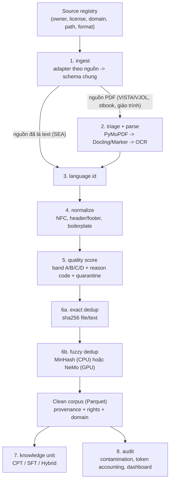

# Chiến lược xử lý dữ liệu (vi-corpus-etl)

> Trạng thái: **thiết kế** (chưa có code, trừ bước tải SEA). Tham khảo `paper-data-etl` và `ViLA`,
> đã rà soát và điều chỉnh (xem mục 5). Lộ trình theo tuần xem `docs/ROADMAP.md`.

## 1. Nguyên tắc
- **Disk-chained**: mỗi stage đọc Parquet của stage trước, ghi Parquet + manifest mới; chạy lại từng stage độc lập, có checkpoint theo file (dùng lại cơ chế `vi_corpus/sea/checkpoint.py` và `vi_corpus/common/state.py`).
- **Raw-first**: dữ liệu gốc giữ nguyên, mọi bước xử lý ghi ra thư mục riêng (`data/raw/` không bị sửa).
- **Kiến trúc lai**: stage tự viết (Python + Parquet/DuckDB, chạy được trên Jupyter). Stage nặng (fuzzy dedup, quality filter) có adapter NeMo Curator, chỉ bật khi có Ray/GPU.
- **Không sửa nội dung**: chỉ chuẩn hóa Unicode/định dạng; không paraphrase, dịch, hay sửa số liệu/tên/DOI.
- **Mọi lần loại bỏ đều có reason code**; chất lượng kỹ thuật và quyền sử dụng là hai trục tách biệt.
- **Không chia train/val/test ở tầng corpus**; việc chia (CPT/SFT/Hybrid) làm ở tầng knowledge unit, luôn chia theo `dedup_family_id`.

## 2. Luồng xử lý

## 3. Schema chung của clean corpus
`doc_id, source_key, source_path, source_sha256, text, language, domain, license, owner, rights_status, quality_band, reason_codes[], token_count, dedup_family_id, parser, normalizer_version, created_at`

KPI "≥95% truy vết nguồn" = tỷ lệ bản ghi có đủ `source_key`, `source_path`, `source_sha256`.

## 4. Quy tắc theo nguồn
| Nguồn | Điểm cần nhớ |
|---|---|
| SEA | Đã là text nên bỏ bước parse. `conversations` của SEA-Instruct-2602 là chuỗi Python-repr → `ast.literal_eval`, không dùng `json.loads`. |
| stbook | PDF toàn ảnh (mỗi trang 1 JPEG) nên bỏ triage, OCR thẳng: PaddleOCR detect + VietOCR nhận dạng (`vi_corpus/common/ocr.py`), kết quả ở `interim/stbook_ocr/`. Mỗi cuốn một bản ghi; text là OCR thô (còn số trang, chú thích) → normalize xử lý. |
| Giáo trình (Drive) | PDF/pptx, phần lớn có lớp chữ; trích bằng `vi_corpus/common/pdf_text.py`, làm sạch theo trang (header/footer, ghép dòng) trước khi ghép văn bản. Giữ sách tiếng Anh. Chi tiết: `docs/GIAO_TRINH.md`. |
| VISTA / VJOL | Chỉ **xử lý**, không crawl. PDF đã đặt tên theo sha256 (dùng làm khóa exact dedup). Cần triage (`text_native`, `mixed`, `image_only`, `corrupt`, `protected`, `non_article`) rồi parse "rẻ trước, đắt sau". Bài ở VJOL/VISTA chưa rõ quyền → `rights_quarantine`. |

## 5. Điểm đã điều chỉnh so với repo tham khảo
1. Split train/val/test chuyển xuống tầng knowledge unit (ảnh yêu cầu ma trận CPT/SFT/Hybrid).
2. Reducer/visualize: fit UMAP/PCA trên mẫu phân tầng, một `cluster_id` chung (HDBSCAN chạy một lần), dùng Datashader khi trên 100k điểm.
3. Dedup viết mới (ViLA chưa có): exact + fuzzy, gán `dedup_family_id`.
4. Không dùng normalizer/NER pháp lý của ViLA cho văn bản khoa học hoặc SEA.
5. Rights gate cấu hình trong source registry, mặc định `unknown -> quarantine`.
6. Chỉ dùng uv + `pyproject.toml` (không còn `requirements.txt`).
